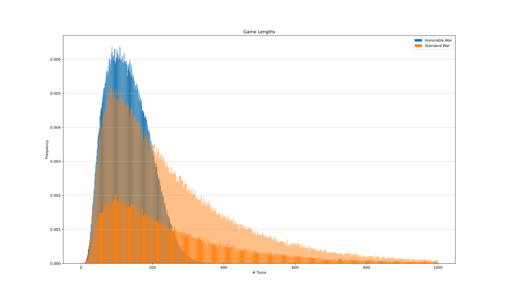

# War Card Game

A simple implementation of the War card game and some variants, used to determine the average length of a game and the win probability of asymmetrical initial starting decks.

The game is as follows: each player starts with half of the deck of the cards. In each round, they both play the top card from their deck, and the player with the greater card value claims both cards for their discard. If the card values are equal, both players play three upside-down cards as bounty, and then another face-up card as the new determiner, repeating as necessary.

If a player's deck is empty, they shuffle their discard, and it becomes their new deck. If they did not have three cards to play upside-down, they play all their cards and the last is the determiner. If their discard is also empty and they cannot play a face-up card, they lose (or tie in the rare event that both players do not have a card).

I also implement the variant Honorable War, where if a card loses a battle by a single rank (for example a 9 beating 8), the loser is ashamed, and is removed from the game. This rule has the effect of substantially reducing the overall game length.

For example:

```
Standard war (shuffled):
  300,000 games in 1.287859118s
  mean score: Player 1 wins 50.1%
  mean turns: 268.42 +/- 218.16

Honorable war (shuffled):
  400,000 games in 1.044328929s
  mean score: Player 1 wins 50.1%
  mean turns: 132.05 +/- 59.88
```


